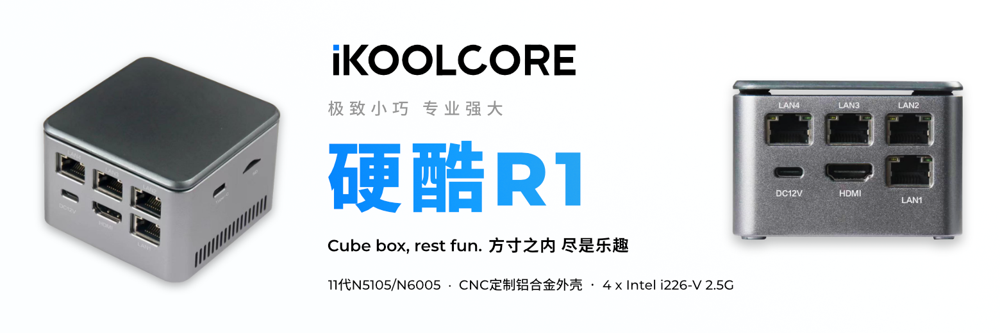

|  CPU  | 内存大小  `板载，双颗粒双通道，不可升级` |     硬盘大小  `协议 二选一`      |  价格  |                           购买链接                           |
| :---: | :-----------------------------------------: | :---------------------------------: | :----: | :----------------------------------------------------------: |
| N5105 |                     8GB                     |  `不带，SATA协议`或 `NVMe协议`   | ￥999  |  |
|       |                    16GB                     | `不带，SATA协议` 或  `NVMe协议` | ￥1299 |  |
|       |                                             |                                     |        |                                                              |
| N5105 |                     8GB                     | 128GB `SATA协议` 或  `NVMe协议` | ￥1199 |  |
|       |                    16GB                     | 128GB `SATA协议` 或  `NVMe协议` | ￥1199 |  |
|       |                                             |                                     |        |  |
| N5105 |                    16GB                     | 512GB `SATA协议` 或  `NVMe协议` | ￥1799 |  |
|       |                                             |                                     |        |                                                              |
| N6005 |                     8GB                     |  `不带，SATA协议`或 `NVMe协议`   | ￥1199 |  |
|       |                    16GB                     | `不带，SATA协议` 或  `NVMe协议` | ￥1499 |  |
|       |                                             |                                     |        |                                                              |
| N6005 |                     8GB                     | 128GB `SATA协议` 或  `NVMe协议` | ￥1399 |  |
|       |                                             |                                     |        |                                                              |
| N6005 |                    16GB                     | 512GB `SATA协议` 或  `NVMe协议` | ￥1999 |  |

##### 选购建议：

1. 如果是计划物理机安装开源操作系统，选择 `N5105 + 8GB + 128GB` 足够折腾；
2. 如果是计划玩虚拟机，那么建议内存优先考虑16GB，如果仅是PVE下双软路由，8GB内存也是足够的；
3. 关于带硬盘配置的硬盘品牌问题：
   硬酷科技找OEM合作厂商专属定制硬盘，质保3年，放心使用。 带硬盘配置订单，如需要代为安装系统，需下单时备注所需安装的开源操作系统。 部分512GB NVMe协议硬盘为从某售后服务中心拿到的三星PM991、PM991A、镁光C2450、西数SN740等数量极少， 优先给早期项目支持者 <small>**（已结束）**</small>。
4. OEM定制硬盘标签纸如下图所示： 
   

<H5>
方寸之间 尽享乐趣 颜  值  在  线  性  能  强  劲

